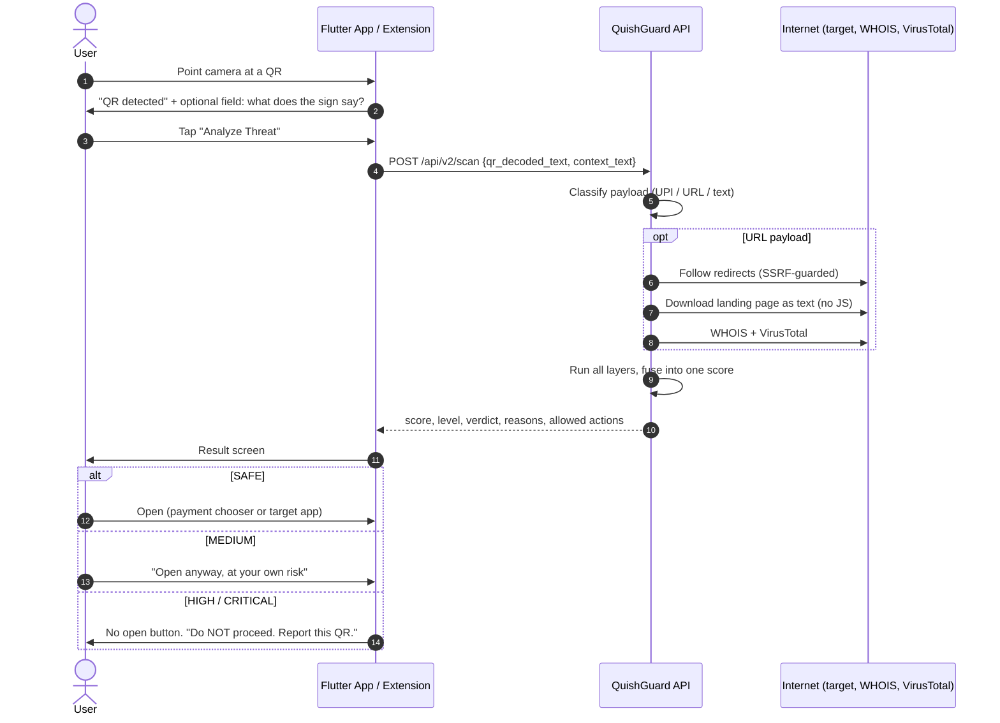
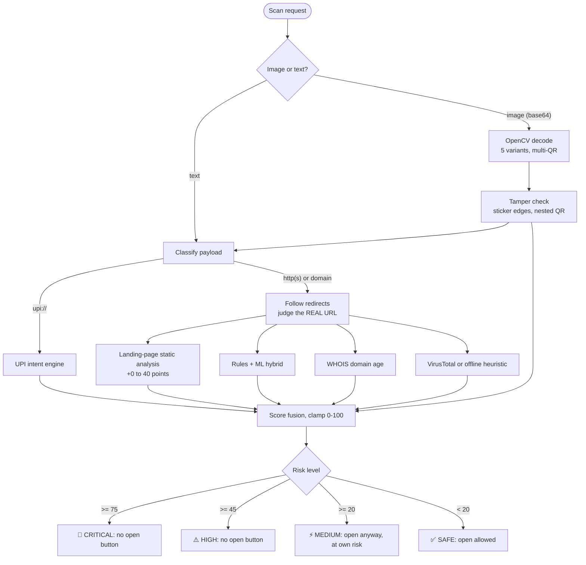
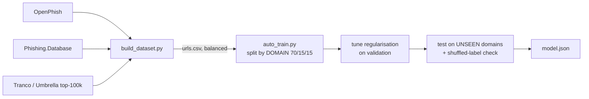

<div align="center">


# QuishGuard AI

**Scan it *before* you pay it.**
QR-phishing and UPI-fraud defense that explains every verdict in plain words.

<!-- 📸 Add a screenshot or GIF of the app's result screen here -->

</div>

---

## Table of contents

[Problem](#-the-problem) · [Solution](#-our-solution) · [Workflow](#-workflow) · [Detection layers](#-the-six-detection-layers) · [ML model](#-the-ml-model) · [Scoring](#-scoring-and-decisions) · [API](#-api) · [Apps](#-the-apps) · [Security](#-security-and-privacy) · [Quick start](#-quick-start) · [Demo](#-demo) · [Tests](#-tests) · [Limitations](#-honest-limitations) · [Roadmap](#-roadmap)

---

## 🚨 The problem

In India, QR codes are how people pay, which makes them a perfect attack surface. Nobody can read a QR with their eyes.

| Attack | How it works |
|---|---|
| **"Scan to RECEIVE ₹5,000"** | The sign says *receive*, but the QR is a **payment request**. Entering your UPI PIN sends money **out**. |
| **Sticker swap** | A fake QR is pasted over a genuine merchant's code. |
| **Hidden destinations** | Short links and redirect chains hide where you really land. |
| **Look-alike domains** | `paytmm.com`, `g00gle.com`, `xn--pypal-4ve.com`, `accounts.google.com.evil.io` |

Ordinary URL scanners miss most of this. They don't understand **UPI intent**, they don't look at the **QR as a physical object**, and they don't tell a normal person *why* something is dangerous.

## 🛡️ Our solution

QuishGuard analyses a QR **before** you pay or open it and returns:

- a **0-100 threat score** and a level: `SAFE` · `MEDIUM` · `HIGH` · `CRITICAL`
- a **plain-language reason**, e.g. *"Sign says RECEIVE but this QR will DEBIT Rs.5,000 from YOUR account!"*
- an **enforced action**: safe QRs get an open button, risky ones get a warning gate, dangerous ones get **no button at all**

It is a full stack: a **FastAPI + OpenCV + ML backend**, a **Flutter scanner app** and a **Chrome extension**, all powered by one API. The clients are deliberately thin: every decision is made server-side, so the logic lives in one place and can be tested and improved without shipping a new app.

| | Typical URL checker | **QuishGuard AI** |
|---|:---:|:---:|
| Understands UPI `pay` vs `receive` intent | ❌ | ✅ |
| Detects pasted-sticker tampering in the image | ❌ | ✅ |
| Follows short links and judges the **real** destination | sometimes | ✅ (SSRF-safe) |
| Looks **inside** the landing page for credential grabbing | rarely | ✅ (no JS executed) |
| Look-alike / punycode / brand tricks by **registered domain** | ❌ | ✅ |
| Explains the verdict in plain language | ❌ | ✅ |
| Removes the "open" button for dangerous QRs | ❌ | ✅ |
| Honest about what it *can't* see | ❌ | ✅ |

---

## 🔄 Workflow

### What the user sees



### Inside one scan



### Step by step

1. **Capture.** The app decodes the QR on-device (`mobile_scanner`). The API can also take a raw **image** and decode it with OpenCV.
2. **Context (optional).** The user types what the physical sign says. This is how the pay-vs-receive scam is caught.
3. **Classify.** The payload is typed `UPI`, `URL` or `TEXT` and mapped to the app that should open it.
4. **Resolve.** For URLs, redirects are followed so the *final* destination is judged, not the short link.
5. **Inspect.** The landing page is downloaded as static text and scanned for phishing signals.
6. **Analyse.** Rules + ML (URL), UPI engine (payments), WHOIS (domain age), VirusTotal (reputation).
7. **Fuse.** Evidence is combined with documented weights into one 0-100 score.
8. **Gate and explain.** The score becomes a level, the level decides whether the app may open the target, and reasons are shown as plain-language bullets.

---

## 🧩 The six detection layers

### 1. Vision (`vision_service.py`)
- Tries **five image variants** in order (colour → grayscale → denoised → adaptive threshold → 2× upscale) and stops at the first that decodes, so blur, glare and small codes still work.
- Reads **multiple QR codes** in one photo.
- **Tamper signals:** `STICKER_EDGE_PATTERN` (6+ long straight edges around the code via Canny + Hough lines, typical of a pasted sticker) and `NESTED_QR` (a QR on top of a QR).

### 2. Redirect resolver (`redirect_service.py`)
- Follows up to **5 hops** manually and re-checks every hop.
- **SSRF guard:** resolves the host and refuses private, loopback, link-local and reserved IPs, and anything unresolvable.
- 3 or more hops add +10 to the score.

### 3. Rules engine (`hf_service.py`, `domain_utils.py`)
The core rule: **never test "brand in URL". Always compare the registered domain.** `paytm.com` is official; `paytm.com.evil.io` and `paytm-kyc.xyz` are not.

| Rule | Weight | Example |
|---|--:|---|
| Look-alike (Levenshtein ≤ 1 or leetspeak) | 0.55 | `paytmm.com`, `g00gle.com` |
| Brand impersonation | 0.45 | `paytm-kyc-verify.xyz` |
| Homograph (punycode / non-ASCII) | 0.45 | `xn--pypal-4ve.com` |
| Raw IP address | 0.45 | `http://192.168.5.4/pay` |
| Risky TLD (`tk ml ga cf gq xyz top buzz click link ...`) | 0.40 | `reward.tk` |
| `@` trick | 0.30 | `google.com@evil.io` |
| URL shortener | 0.25 | `bit.ly` |
| Pressure keywords (`verify kyc claim otp ...`) | ≤ 0.25 | |
| Plain HTTP | 0.15 | |
| Too many dots/dashes | 0.10 | |

Trusted and official domains (Google, GitHub, IRCTC, Paytm, SBI, HDFC and others) short-circuit to a score of **0**, so the engine doesn't cry wolf.

### 4. ML model
See [The ML model](#-the-ml-model).

### 5. UPI intent engine (`upi_service.py`)
Parses `upi://pay?pa=…&pn=…&am=…&tn=…`:

| Check | Severity | Points |
|---|---|--:|
| **Sign says receive, QR is a payment** | CRITICAL | +50 (+55 with an amount) |
| Amount ≥ ₹10,000 / ≥ ₹2,000 | HIGH / MEDIUM | +25 / +12 |
| Missing or malformed UPI ID | HIGH | +40 |
| Suspicious ID (`test…`, `scam…`, 22+ random letters, 13+ digits) | HIGH | +30 |
| Lure words (`refund`, `cashback`, `kyc`, `lottery`...) | MEDIUM | +20 |
| Unknown PSP handle (not in our ~75-handle list) | LOW | +8 |
| Generic or missing payee name | LOW | +5 |

Phone-number UPI IDs (`9876543210@ybl`) are **normal in India and are not flagged**. A safe QR returns a specific verdict such as *"SAFE. Payee: RajTeaStall (teashop@paytm) on Paytm."*

### 6. Landing page and domain intelligence
**Page analyser (`page_service.py`)** looks *inside* the destination. It can only **add** risk (capped at +40).

| Signal | Points |
|---|--:|
| Login/payment form posts to a **different site** | 20 |
| Brand impersonation (brand in title + credential page) | 8-18 |
| Sensitive fields (OTP, card, UPI PIN, Aadhaar/PAN, IFSC) | 12-16 |
| Form sends data straight to an email address | 15 |
| Obfuscated JavaScript (`eval(atob(...))`) | 12 |
| Hidden iframe to a third party | 12 |
| Urgent language ("account suspended", "verify KYC") | ≤ 12 |
| Password on plain HTTP / form to raw IP / silent meta-refresh | 10 each |
| Password field / right-click blocked | 6 / 4 |
| JS-only page (can't be inspected) | 0, info only |

**Intel (`threat_api_service.py`):** WHOIS domain age (under 7 days = very high risk) plus optional live **VirusTotal**. If WHOIS fails, the age is reported as `UNKNOWN`. Without an API key, VirusTotal falls back to an offline heuristic that **labels itself as offline**.

---

## 🧠 The ML model

A **24-feature logistic regression implemented in pure NumPy** (no scikit-learn needed to train or run). It classifies a *domain name* and explains itself.

- **Features:** length, dots, dashes, digit ratio, entropy, vowel ratio, longest label, longest digit run, risky TLD, punycode, IP host, keyword hits (in host), brand in host, hidden `com/net` in subdomain, and more.
- **Explainability:** because it is linear, each feature's contribution is exact. The top contributors become sentences like *"Domain looks random"* or *"Cheap/abused domain ending"* in the app.
- **Hybrid blend:** `P = max(rule_score, 0.5 × rule_score + 0.5 × ML)`. Rules catch known tricks, ML catches unknown patterns, and a confident rule is never diluted.
- **Domain-only on purpose:** ~48% of phishing hosts in our data have a sub-domain versus ~6% of safe ones. Letting the model see that would teach it a dataset artifact. Sub-domain tricks are handled by the rules layer instead, and train and inference use identical normalisation.

### Training pipeline



### Results (unseen-domain test set)

| Precision | Recall | F1 | ROC-AUC | Dataset | Test rows |
|:---:|:---:|:---:|:---:|:---:|:---:|
| **0.851** | **0.744** | **0.794** | **0.864** | 5,558 (2,779 / 2,779) | 831 |

These numbers are modest **on purpose**. The split is grouped by registered domain (no test domain seen in training), regularisation is tuned on validation only, a shuffled-label control must score near 0.5, and an AUC above 0.995 raises a data-leak warning. Mislabelled "phishing" rows that are really top-100k sites are removed. A name-only model on unseen domains is hard, which is why ML is **one signal among six**.

Retrain: `cd backend && python ml/auto_train.py` (add `--skip-download` to reuse the data).

---

## ⚖️ Scoring and decisions

**Fusion**

| Payload | Formula |
|---|---|
| UPI | `score = upi_risk_score` |
| URL | `0.45 × ML/rules% + 0.30 × WHOIS risk + 0.25 × VirusTotal score` |
| Other | `max(upi_risk_score, 0.50 × ML/rules%)` |

Then **additive only**: tamper signals `max(score, 50) + 10 × signals`, 3+ redirect hops `+10`, landing-page signals `+0…40`. Clamped to 0-100.

**What the app is allowed to do**

| Score | Level | Open button |
|--:|---|---|
| ≥ 75 | 🚨 **CRITICAL** | None |
| ≥ 45 | ⚠️ **HIGH** | None |
| ≥ 20 | ⚡ **MEDIUM** | "Open anyway, at your own risk" |
| < 20 | ✅ **SAFE** | Normal |

A CRITICAL UPI finding replaces the verdict text with its specific reason. The response also names the target app (`payment`, `whatsapp`, `telegram`, `maps`, `browser`, `email`, `phone`...). On Android, payment QRs open the system **"Pay with" chooser**, so the user picks any installed UPI app.

---

## 🔌 API

Base URL `http://localhost:8000` · Swagger docs at **`/docs`** · version `3.0.0`

**`GET /api/health`** (alias `/api/v2/health`) returns service status and version.

**`POST /api/scan`** (alias `/api/v2/scan`): send **either** `qr_decoded_text` **or** `qr_image_base64`.

| Field | Description |
|---|---|
| `qr_decoded_text` | Decoded QR contents (URL, `upi://…`, text) |
| `qr_image_base64` | Base64 image, max ~4 MB |
| `context_text` | Optional: what the sign next to the QR says |
| `scan_source` | Optional tag, e.g. `flutter_mobile_camera` |

| Status | Meaning |
|--:|---|
| 400 | No payload, or no QR found in the image |
| 413 | Image too large |
| 429 | Over 30 scans per minute per IP |

The response contains `threat_score`, `risk_level`, `verdict`, `recommendation`, `reasons`, `target_app`, `auto_open_allowed`, `manual_open_allowed` and a full `analysis` block with the evidence from every engine (see the demo below).

---

## 📱 The apps

**Flutter app (`frontend/`)**: Splash → Home (backend status, scan counters) → live Scanner → "QR detected" dialog with a sign-text field → Results. It obeys the server's `auto_open_allowed` / `manual_open_allowed` flags, shows an explicit **"OLD backend detected"** message if the new API routes are missing, and takes its backend address from `--dart-define=BACKEND_URL=…`.

**Chrome extension (`extension/`, Manifest V3)**: right-click any text, link or image → **🛡️ Scan with QuishGuard AI** (result as a notification), or paste into the popup. It polls backend health every 8 seconds and keeps local scan and threat counters.

---

## 🔒 Security and privacy

QuishGuard fetches attacker-chosen URLs, so it is defensive by design.

| Risk | Mitigation |
|---|---|
| SSRF (QR pointing at `localhost` or `169.254.169.254`) | Private, loopback, link-local and reserved IPs refused for redirects and page fetches |
| Malicious pages | **No JavaScript is ever executed**; HTML is only downloaded as text |
| Resource abuse | 4 s total timeout (defeats slow-drip servers), 300 KB page cap, ports 80/443 only, 5-hop cap, ~4 MB image cap, 30 scans/min per IP |
| XSS through our own output | Text copied from hostile pages is stripped to a safe charset, because the extension renders server text |
| Blocked event loop | `scan` is a plain `def`, so FastAPI runs it in a thread pool and slow WHOIS/VirusTotal calls don't freeze the server |
| False reassurance | Page and tamper layers can only raise a score; unknown WHOIS is `UNKNOWN`; offline VirusTotal is labelled offline |

**Privacy:** no database and no stored scan history. Analysing a URL does involve server-side lookups (the target site, WHOIS and, if you set a key, VirusTotal), so host the backend somewhere you trust. The server logs a one-line summary per scan to stdout.

---

## 🚀 Quick start

```bash
git clone <your-repo-url> && cd QuishGuard-AI
docker compose up --build
```

API → **http://localhost:8000** · Docs → **http://localhost:8000/docs**

<details>
<summary><b>Run without Docker</b></summary>

```bash
cd backend
python -m venv .venv && source .venv/bin/activate     # Windows: .venv\Scripts\activate
pip install -r requirements.txt
python main.py
```
</details>

<details>
<summary><b>Run the Flutter app</b></summary>

```bash
cd frontend && flutter pub get
flutter run --dart-define=BACKEND_URL=http://<YOUR_LAPTOP_LAN_IP>:8000   # real phone, same Wi-Fi
flutter run --dart-define=BACKEND_URL=http://10.0.2.2:8000               # Android emulator
```
</details>

<details>
<summary><b>Load the Chrome extension</b></summary>

`chrome://extensions` → enable **Developer mode** → **Load unpacked** → select `extension/`. Keep the backend running on `localhost:8000`.
</details>

<details>
<summary><b>Enable live VirusTotal (optional)</b></summary>

```bash
VIRUSTOTAL_API_KEY=your_key docker compose up --build
```
</details>

<details>
<summary><b>Rebuild the dataset</b></summary>

`backend/ml/data/` is git-ignored, so rebuild it with `python ml/build_dataset.py` (needs internet). You can add your own links in `ml/data/my_phish.txt` and `ml/data/my_safe.txt`.
</details>

---

## 🎬 Demo

Ready-made QR codes are in `demo/` (regenerate with `pip install qrcode[pil]` then `python demo/generate_qr_codes.py`).

| QR | What it shows | Result |
|---|---|:---:|
| `scam_qr_codes/1_upi_receive_scam.png` + sign text *"Scan to RECEIVE ₹5000"* | Pay-vs-receive scam | 🚨 CRITICAL |
| `scam_qr_codes/2_free_tld_phishing.png` | `paytm-verify-reward.tk` | 🚨 HIGH+ |
| `scam_qr_codes/3_brand_impersonation.png` | Fake GPay on `.xyz` | ⚠️ HIGH+ |
| `scam_qr_codes/4_http_insecure.png` | Fake HDFC over plain HTTP | ⚠️ HIGH+ |
| `scam_qr_codes/5_suspicious_keywords.png` | `amazon-prize-winner.link` | ⚠️ HIGH+ |
| `safe_qr_codes/safe_upi_small.png` | Real ₹20 tea-stall payment | ✅ SAFE |
| `safe_qr_codes/safe_google.png`, `safe_github.png` | Trusted domains | ✅ SAFE |

**Try the scam from a terminal:**

```bash
curl -X POST http://localhost:8000/api/scan -H "Content-Type: application/json" -d '{
  "qr_decoded_text": "upi://pay?pa=scammer123@ybl&pn=FakeCashback&am=5000&tn=Reward",
  "context_text": "Scan to RECEIVE Rs 5000"
}'
```

```jsonc
{
  "threat_score": 100.0,
  "risk_level": "CRITICAL",
  "verdict": "🚨 Sign says RECEIVE but this QR will DEBIT Rs.5,000.00 from YOUR account!",
  "recommendation": "DO NOT PROCEED. Report this QR.",
  "target_app": { "category": "payment", "label": "Payment App" },
  "auto_open_allowed": false,
  "manual_open_allowed": false,
  "analysis": { "upi_analysis": { "risks": [
    { "severity": "CRITICAL", "type": "PAY_VS_RECEIVE_MISMATCH" },
    { "severity": "MEDIUM",   "type": "HIGH_AMOUNT" },
    { "severity": "HIGH",     "type": "SUSPICIOUS_VPA" },
    { "severity": "MEDIUM",   "type": "LURE_KEYWORD" } ] } }
}
```

**Suggested 3-minute walkthrough:** show the **System Online** badge → scan a safe UPI QR (it names the payee and offers the payment chooser) → scan the "RECEIVE ₹5000" scam with its sign text (CRITICAL, no open button exists) → scan a `.tk` impersonation QR and read the reasons → show the extension popup → close on the honest ML numbers and limitations.

---

## 🧪 Tests

```bash
cd backend && python -m pytest tests -q
```

- `test_engine.py`: known-bad URLs must be flagged and known-good ones stay safe (including tricky names like `taxi.com`); UPI receive-scam scores ≥ 50 and a normal phone-number payment stays under 20.
- `test_page_service.py`: runs **fully offline** (network faked). Covers a full phishing page hitting every signal and capping at 40, a clean page scoring 0, analytics iframes and "Sign in with Google" buttons not being flagged, hostile text sanitised, broken HTML never raising, private hosts refused without any network call, no redirect following, non-HTML rejected, and the size cap.

---

## ⚠️ Honest limitations

- The ML layer sees only the **domain name** (recall 0.744), so it is a supporting signal and not a standalone detector.
- Page analysis is **static**: forms built by JavaScript are invisible. *A page with no signals is not proven safe.*
- Sticker-tamper detection is **heuristic**, not a guarantee.
- The pay-vs-receive check depends on the user **typing the sign text** (OCR is on the roadmap).
- The UPI handle list is finite (~75); DNS could change between our safety check and the fetch (rebinding); WHOIS can fail.
- A hacked *trusted* site is out of scope, since trusted domains are not inspected.
- Rate limiting is in-memory and per-process; production needs a gateway.
- Legacy naming: `hf_service.py` and the `huggingface_ai` JSON key refer to the **rules + NumPy ML hybrid**. No Hugging Face model is called.
- The app and extension default to local or LAN backends; real-world use needs a hosted HTTPS backend.

## 🗺️ Roadmap

📷 On-device OCR of the physical sign · 🌐 headless-browser analysis of JS-built pages · 🗂️ community "report this QR" feed · 🌍 Hindi and regional-language explanations · 🔒 hosted HTTPS deployment with auth · 🍎 iOS release

---

## 📁 Project structure

```
QuishGuard-AI/
├── docker-compose.yml
├── backend/
│   ├── main.py                    # FastAPI app: routing, score fusion, action gating
│   ├── services/
│   │   ├── vision_service.py      # OpenCV decode + tamper detection
│   │   ├── redirect_service.py    # SSRF-safe redirect follower
│   │   ├── page_service.py        # static landing-page analysis
│   │   ├── upi_service.py         # UPI intent / VPA engine
│   │   ├── hf_service.py          # rules engine + ML blending
│   │   ├── ml_service.py          # 24 features + NumPy inference
│   │   ├── domain_utils.py        # registered domain, brands, look-alikes
│   │   └── threat_api_service.py  # WHOIS + VirusTotal
│   ├── ml/                        # build_dataset.py, auto_train.py, train_model.py, model.json
│   └── tests/
├── frontend/                      # Flutter app (splash, home, scanner, results)
├── extension/                     # Chrome MV3 extension (background.js, popup/)
└── demo/                          # safe + scam QR codes and generator
```

## 🧰 Tech stack

Python 3.11 · FastAPI · Uvicorn · Pydantic v2 · OpenCV · NumPy · Pillow · python-whois · VirusTotal v3 · Flutter / Dart (`mobile_scanner`, `android_intent_plus`, `url_launcher`) · Chrome Extension MV3 · Docker · pytest · OpenPhish · Phishing.Database · Tranco

---

<div align="center">

**QuishGuard AI**: the safest scan is the one you make *before* you pay.

</div>
